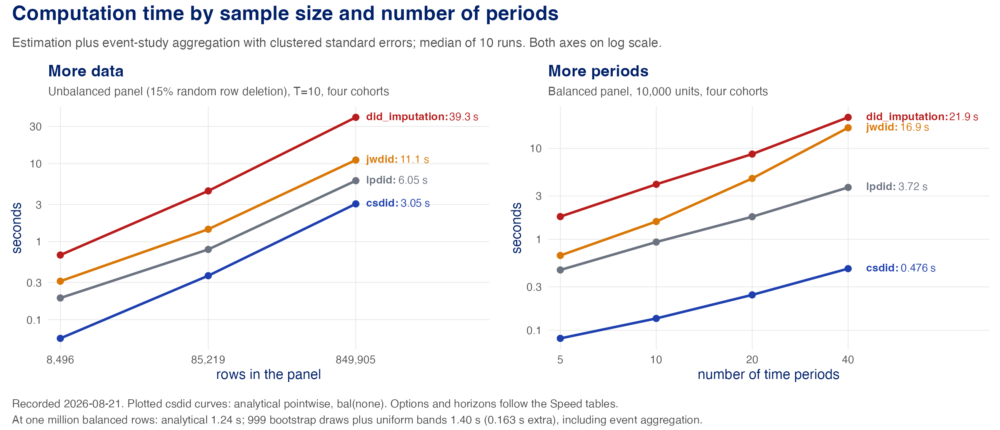

# How csdid compares with other DiD Stata commands

We are living in a time where applied econometrics papers are commonly paired with Stata, R, or Python packages. On one hand, this is really great, as it substantially lowers the barrier to using modern econometric methods in concrete applications. Everything else equal, we all like fast and reliable implementations of econometrics papers. On the other hand, when multiple packages implementing related procedures are available, one may be tempted to try several of them, perhaps without going back to the original papers. This is where we enter some potentially dangerous territory. At the end of the day, do these different estimators even target the same causal parameter? Do they reflect similar notions of uncertainty to warrant comparisons in precision? These questions are very important for econometric theory and practice, as they can lead to never-ending discussions.

When it comes to Difference-in-Differences (DiD), this is perhaps even more interesting and important, as DiD is arguably the most popular observational causal inference method in economics; [see here for some evidence](https://paulgp.com/econlit-pipeline/paper.html). In recent years we have seen a boom of modern DiD tools aimed at allowing for richer notions of heterogeneity than standard two-way fixed effects specifications, each paired with a companion Stata command: [Callaway and Sant'Anna (2021)](https://doi.org/10.1016/j.jeconom.2020.12.001) with `csdid` (this package), [Wooldridge (2025)](https://doi.org/10.1007/s00181-025-02807-z) with `jwdid`, [Borusyak, Jaravel, and Spiess (2024)](https://doi.org/10.1093/restud/rdae007) with `did_imputation`, de Chaisemartin and D'Haultfœuille ([2020](https://doi.org/10.1257/aer.20181169), [2026](https://doi.org/10.1162/rest_a_01414)) with `did_multiplegt_dyn`, [Dube et al. (2025)](https://doi.org/10.1002/jae.70000) with `lpdid`, [Sun and Abraham (2021)](https://doi.org/10.1016/j.jeconom.2020.09.006) with `eventstudyinteract`, and [Deb et al. (2026)](https://www.nber.org/papers/w33026) with `flexdid`, among others. For someone who has not been breathing the DiD literature every day, it is tempting to treat these packages as interchangeable ways to obtain "the" event study. But, as we discuss in this article, that is not always the case. Our main goal here is to compare what each command estimates and how it conducts inference. To that end, we use simulations that you can reproduce line by line. We focus **exclusively** on binary treatments and staggered designs here. Stata itself also ships official commands for this setting, `xthdidregress` for panels and `hdidregress` for repeated cross sections, and we include them too: they are the commands a user reaches for without installing anything, so leaving them out would misrepresent the choice actually facing an applied researcher. We compare our `csdid` estimator with these Stata packages in their currently available version in `ssc` on July 31, 2026, and the official commands as shipped with StataNow/MP 19.5. For simplicity, we assume that (conditional) parallel trends hold in all periods and across all groups, and covariates are time-invariant (but their effects can be time-varying). We note that in this setting, none of these procedures we discuss is semiparametrically efficient [Chen, Sant'Anna, Xie (2025)](https://psantanna.com/files/Efficient_DiD.pdf).

To summarize our findings (as this is not a mystery novel), it is worth pinpointing some broader cases:

- ***Balanced panel data without covariates***: most of the point estimates agree across packages, though their standard errors may differ even when the point estimates are the same. This happens because some procedures treat the treatment group as fixed rather than random. Following [Callaway and Sant'Anna (2021)](https://doi.org/10.1016/j.jeconom.2020.12.001), `csdid` treats cohort membership as random, so uncertainty in the estimated cohort shares enters its standard errors; `eventstudyinteract` makes the same choice, and accounts for the sampling uncertainty of its estimated cohort shares. Most other packages condition on treatment assignments (excluding the experimental assignment as a special case), or deliberately report conservative standard errors when treatment effects are heterogeneous, as `did_imputation` documents. When it comes to point estimates, a notable exception is the `lpdid` package: by default it targets a different type of event study (ES) aggregation, therefore producing an inconsistent (and biased) estimate for the ES parameter as discussed in [Callaway and Sant'Anna (2021)](https://doi.org/10.1016/j.jeconom.2020.12.001) (and many others). By using its `rw` option, though, one can request to bypass this concern and target the same parameter.
- ***Unbalanced panel without covariates***: by default, packages do not agree on the (population) weights used to aggregate ATT(g,t)'s into ES parameters, so they are often not even targeting the same parameter. This, per se, makes comparison across methods delicate. What reconciles several of these targets is not unbalancedness being random per se, as the missingness never depends on cohort, covariates, or potential outcomes in our simulations. It is an auxiliary (strong) condition that the missingness rate is the same in all periods, so that each period contributes an equally sized cross-section. We also note that packages behave differently in how they handle unbalanced panels: what they drop, what they keep, and &mdash; for the commands that take a treatment indicator rather than a cohort variable &mdash; whether missing rows silently change which cohort a unit belongs to. We document all of this, with every claim enforced in code, in [What a missing row does to each command](#what-a-missing-row-does-to-each-command).
- ***Repeated cross-sectional data***: Some packages such as `eventstudyinteract`, `did_multiplegt_dyn`, and `lpdid` do not accommodate this sampling scheme. Others, such as `flexdid`, are built mainly targeting this case. Among those procedures that can handle it, `jwdid`, `did_imputation`, and `flexdid` share one aggregation scheme and `csdid` another, so they do not generally target the same ES parameter. As in the unbalanced panel data case, comparability is restored by the same auxiliary condition: that every period contributes an equally sized cross-section.
- ***The role of covariates***: Not all packages accommodate general heterogeneous treatment effects with respect to covariates, or covariate-specific trends in untreated outcomes. `csdid`, `jwdid`, `flexdid`, and `did_imputation` allow for that. `did_multiplegt_dyn` relies on a different parallel trends assumption, based on outcomes residualized on the *first differences* of the covariates in a linear model, with the covariate coefficient fixed across cohorts and periods. What that assumption rules out can be practically important: any role for time-invariant covariates, which first differencing annihilates; covariate effects on untreated trends that differ across periods, since a single coefficient is imposed across them; and continuous covariates, which the documented fallback `trends_nonparam()` cannot match on at all. `lpdid` and `eventstudyinteract` impose an additional separability condition between covariates and cohorts, too, and are not suitable to capture richer notions of heterogeneity. In [One design that tells them apart](#one-design-that-tells-them-apart) we construct a single balanced panel data generating process, with conditional parallel trends holding exactly, in which all of these restrictions bind at once.
- ***Speed***: `csdid` tends to be faster than the other packages in most of our designs, though sometimes (but definitely not always) the differences are in the milliseconds. The gains depend on the number of observations, cohorts, and time periods, as well as on whether the panel is balanced or not. Speed is nice, of course, but we emphasize that being clear about target parameters and sources of uncertainty matters more.

One aspect we would like to make clear is that, in our view, target parameters need to be defined ex ante, and ideally should not depend on the sampling scheme. We view target parameters as "ideals": what we would like to know if all the data in the world were available.

Before diving into any details, here is a picture of what is at stake. We
take one of the simpler designs from this article &mdash; same population,
no covariates, but survey waves of different sizes across periods &mdash;
and run every command, at its default settings, on the same 500 simulated
samples. The left panel shows where each
command's event-study estimates at e=0 land relative to the population
target; the right panel shows whether their 95% confidence intervals cover
it.


Nothing about the population changed across these commands; they simply do
not target the same parameter, and some targets move with the sampling
scheme while others do not. Some of these commands have options to address the estimand part, though, to address something, you first need to be aware! So we are trying to make people aware here. The rest of this article digs more into these issues by discussing
[what each command computes](#what-each-command-is-actually-computing), how
the aggregation weights differ, and
[what happens across sampling schemes](#reliability-part-i-no-covariates).

Another aspect that we want to mention is related to speed: `csdid` tends to be very fast, and scales well with different aspects of the data.



The [Speed section](#speed) discusses more about these run time differences, in multiple settings.

## Some Monte Carlo details
To keep the comparisons relatively simple, the main Monte Carlo settings use 1,000
units per draw, seven periods, and 500 simulation draws. When we deviate from this setting, such as when we compare speed across packages, we document it clearly.

In our simulations about DiD setups without covariates, discussions about precision and simultaneous inference, we have a more plain DGP, in which untreated outcomes are

$$Y_{it}(0) \;=\; \mu_i + 0.3\,t + \varepsilon_{it},$$

with unit effects and errors drawn from independent standard normal distributions. We consider four
equally sized groups, with cohorts first treated at $$g \in \{3,4,5\}$$ as the "eventually-treated" cohorts and a
never-treated group. In our baseline simulations, treatment effects for each cohort $$g$$ at time $$t$$ are given by $$\tau(g,t) = (g-2) + 0.5\,(t-g)$$, so the building
blocks are $$ATT(g,\,g+e) = (g-2) + 0.5\,e$$ and the
event-study targets are exactly 2.0, 2.5, and 3.0 at $$e = 0, 1, 2$$. Note that, here, we impose homogeneous treatment effect dynamics (with different jumps at $$e=0$$), and that parallel trends hold in all periods. In fact, in all our simulations, parallel trends will hold in all periods, though sometimes it requires you to condition on covariates and allow for covariate-specific trends.

In some sections, especially when we want to stress the role of some aspects of the estimators, e.g. how they handle covariates, we modify the DGPs and discuss how we do it. We want to be very explicit that our simulations here are designed to be pedagogical, so we can highlight what happens with different procedures when some aspects of the DGP change. We make these modifications so the results change loudly and we can report them clearly in tables and plots. In concrete empirical applications, these differences may be more nuanced, but, hey, we don't control the environment there! So, again, the value of our exercises is to make clear the differences between DiD procedures implemented in Stata.

<nav class="toc">
<div class="toc-title">Contents</div>
<ul>
<li><a href="#what-each-command-is-actually-computing">The command map</a></li>
<li><a href="#speed">Speed</a></li>
<li><a href="#reliability-part-i-no-covariates">Reliability I — no covariates</a></li>
<li><a href="#what-a-missing-row-does-to-each-command">Missing rows</a></li>
<li><a href="#reliability-part-ii-covariates-and-the-case-for-doubly-robust">Reliability II — covariates and DR</a></li>
<li><a href="#one-design-that-tells-them-apart">One design that tells them apart</a></li>
<li><a href="#precision">Precision</a></li>
<li><a href="#simultaneous-inference">Simultaneous inference</a></li>
<li><a href="#reproducing-everything">Reproducing everything</a></li>
<li><a href="#what-we-take-from-this">What we take from this</a></li>
</ul>
</nav>

## What each command is actually computing

We start the discussion by trying to understand better what each command computes. This is something that we view as first-order important, and it is not something we can always settle by reading the documentation and the papers. Sometimes, software evolves, and we start covering cases that we did not fully discuss in the paper---this often arises as users request new use-cases to cover their specific setting. So, with time, there is some natural drifting. However, most users do not follow the nitty-gritty details of everything, and end up comparing different implementations, believing they are actually comparable. But guess what, this is not always the case.

In this section, we take stock and try to tackle this relevant problem. We prefer to use numerical exercises rather than detailed statistical derivations. More precisely, we run several controlled simulations, changing one feature of the design at a time and checking the numbers against what each procedure warrants, and add some explanations to justify/rationalize the findings. This sometimes involves reverse-engineering code, cross-checking papers, and the like. But it turns out to be fun to do, and we hope it is useful to you!

Before contrasting the alternatives, we should be explicit about our own benchmark. Following [Callaway and Sant'Anna (2021)](https://doi.org/10.1016/j.jeconom.2020.12.001), `csdid` first estimates the average treatment effect for each group (or cohort; we use the terms interchangeably) that started treatment at period *g* at each period *t* &mdash; the ATT(*g*,*t*) &mdash; from a two-by-two comparison: group *g*'s outcome change from its base period (g-1) to *t*, against the same change among units not yet treated at *t* (the default; `nevertreated` restricts the comparison to never-treated units). Our procedures (flexibly) accommodate covariates via outcome regression, inverse probability weighting, or the doubly robust combination of the two (the default in our package). These ATT(*g*,*t*)'s are the building blocks of the analysis: every other parameter `csdid` reports, including all the event studies, is a weighted average of these ATT(*g*,*t*)'s, with weights given by estimated cohort shares.

The rest of this article covers each of these choices in detail and how different commands differ from ours. As one can foresee, some important dimensions include the choice of the comparison group, the base period used, how one incorporates covariates (and how flexible this is), the aggregation weights used to construct event study aggregations, what variables are treated as random and fixed, among others.

**Building blocks.** Every command here builds its event study from
group-time comparisons of a treated cohort with its untreated counterfactual, and the
commands fall into two camps in how they construct that counterfactual. First, let's talk about the baseline period used. `csdid`, `did_multiplegt_dyn`, `lpdid`, and `eventstudyinteract` compare each cohort with its base period, the period just before treatment. `jwdid` and `did_imputation`, on the other hand, do something
different: they use all untreated observations to fit unit and time
fixed effects, and then impute Y(0) from that fit. This is done in a "literal" sense in the `did_imputation` package, while `jwdid` uses parsimonious regressions with multiple interactions to arrive there. It is worth being explicit about what this implies for the comparison group and the base period: both `did_imputation` and `jwdid` use every untreated observation as part of their comparison group, and use all pre-treatment periods as valid baseline periods, too. This involves some trade-offs, and we return to this later. The default specification of `flexdid` follows a similar route as `jwdid`, but as it implements the estimator of [Deb, Norton, Wooldridge, and Zabel (2026)](https://www.nber.org/papers/w33026), developed for repeated cross-sections, we include it only in those
comparisons. On a balanced panel, `jwdid` and `did_imputation` give identical point estimates, with and without covariates. They don't agree on standard errors as they consider different types of uncertainty, but we will discuss this more later.

`eventstudyinteract` is the one command here that, in setups with a balanced panel and no covariates, agrees with `csdid`
exactly rather than approximately. It implements the interaction-weighted
estimator of [Sun and Abraham (2021)](https://doi.org/10.1016/j.jeconom.2020.09.006),
which shares `csdid`'s logic:
cohort-by-cohort estimates averaged with estimated cohort shares, and the
sampling uncertainty of those shares carried into the standard errors. On a
balanced panel with the `nevertreated` comparison group and no covariates,
the two returned identical point estimates to eight decimal places. When covariates are used, or the data is an unbalanced panel, though, `csdid` and `eventstudyinteract` stop agreeing with each other. Essentially, `eventstudyinteract` leverages covariates in a linear fashion, without interacting the group indicators, which can restrict treatment effect heterogeneity---`csdid`, on the other hand, considers more flexible adjustments, and, therefore, can capture richer notions of heterogeneity; in the design of Part II below, we show the bias of `eventstudyinteract` estimates grows from +0.29 at e=0 to +0.87 at e=2 with coverage of zero, while `csdid` remains unbiased and with solid inference properties. We also show that the weights used by `eventstudyinteract` to aggregate the ATT(*g*,*t*)'s into event study summary parameters vary depending on whether the data is a balanced or unbalanced panel. These are interesting findings, as [Sun and Abraham (2021)](https://doi.org/10.1016/j.jeconom.2020.09.006) establish the validity of their interaction-weighted estimators only for balanced panel data without covariates, a boundary the command's own help file is admirably candid about.

`did_multiplegt_dyn` is another interesting comparison for `csdid`. The
command implements the estimators of de Chaisemartin and D'Haultfœuille
([2020](https://doi.org/10.1257/aer.20181169), [2026](https://doi.org/10.1162/rest_a_01414)), which are built for different problems than the one we study here:
treatments that may turn on and off, for example. In our staggered setup, though, they share similarities. In fact, with balanced panel data and no covariates, `csdid`'s event study point estimates coincide with `did_multiplegt_dyn`, as both use not-yet-treated units as the comparison group and anchor the baseline period to the last untreated period available, g-1. The standard errors of these procedures do not agree, but we will discuss this more below. With unbalanced panels (and no covariates), though, this equivalence breaks down, as `did_multiplegt_dyn`'s event-study aggregation weights groups by the number of treated observations available at each horizon rather than by cohort
shares, as we do in `csdid`. The way `did_multiplegt_dyn` handles covariates also differs from ours, as their adjustment rests on a parallel trends assumption
for outcomes residualized on the *first differences* of the covariates, with
one coefficient shared by all cohorts and periods. We view this alternative parallel trends assumption as restrictive and not very natural when one wants to embrace heterogeneity in DiD settings; we discuss this further in Part II below.

**What each command treats as random.** As we mentioned above, some commands
agree on point estimates but not on standard errors. This deserves some
discussion, as it matters in practice. Take `jwdid` and `did_imputation`,
which agree to six decimal places in the exercise above. When treatment
effects vary with covariates, `did_imputation` reports standard errors that
are deliberately conservative under this type of heterogeneity, while
`jwdid` reports conventional sampling-based inference. In a simulation with n = 50,000 and treatment effects that vary with covariates, the difference between them grew from 11% at event time 0 to 55% at event time 2. Here, we stress that one should not say that `jwdid` is "more precise" than `did_imputation`. Well, they have the same point estimates but differ on the type of uncertainty they reflect! By default, both commands treat the covariates and the cohort indicators as fixed; `jwdid`, however, allows you to account for the sampling uncertainty associated with them (use the `vce(unconditional)` option in its `estat` commands, for example), while `did_imputation` does not offer this option. Again, [Borusyak, Jaravel, and Spiess (2024)](https://doi.org/10.1093/restud/rdae007) are clear about the peculiarities of their inference procedures, but we are unsure if practitioners are fully aware. If we were to choose between `jwdid` and `did_imputation`, we would lean towards `jwdid`, as its inference options let you match the uncertainty statement to the sampling scheme.

Something similar happens with `csdid` and `did_multiplegt_dyn`. In designs
where their point estimates coincide, their standard errors still differ by
about 8&ndash;10% in the example we report in the code appendix. Why?
Because they do not treat the same things as random. Following
[Callaway and Sant'Anna (2021)](https://doi.org/10.1016/j.jeconom.2020.12.001),
`csdid` treats cohort membership as random, so uncertainty in the estimated
cohort shares enters its standard errors. The same is true for covariates. `did_multiplegt_dyn`, on the other hand, imposes that cohort membership is fixed and non-random, and its standard errors do not account for it. One important aspect to note here is that, by imposing that groups/cohorts are non-random, one excludes the possibility of treatment timing being random, something that we think would make a good case for the plausibility of parallel trends. Again, every paper and package makes some choices, and these are documented in de Chaisemartin and D'Haultfœuille ([2020](https://doi.org/10.1257/aer.20181169), [2026](https://doi.org/10.1162/rest_a_01414)); we also document this clearly in [Callaway and Sant'Anna (2021)](https://doi.org/10.1016/j.jeconom.2020.12.001). Nonetheless, not every reader and practitioner remembers these details, so, once in a while, it is good to remind them.

**Aggregation.** One dimension from our list above that we have only
touched in passing is the aggregation weights. Every summary parameter these
commands report is a weighted average of the
ATT(g,t) building blocks; the weights, however, differ across commands. We focus on event study aggregations as they are arguably the most popular ones:

<p class="table-title" markdown="span">Event-study aggregation weights, by command</p>

| command                                                    | a cohort's weight at event time e | the weight moves when...    |
| ------------------------------------------------------------ | ----------------------------------- | ----------------------------- |
| `csdid`                                                    | its population share, P(G=g \| G+e ∈ [1,T]) | the population changes      |
| `jwdid`, `did_imputation`, `did_multiplegt_dyn`, `flexdid` | its treated observations at e: P(G=g \| G+e ∈ [1,T], S<sub>G+e</sub>=1) | the sampling changes        |
| `lpdid`                                                    | its effective 2x2 sample size (no population formula) | the adoption *order* changes |
| `eventstudyinteract`                                       | its estimated cohort share at e: P(G=g \| G+e ∈ [1,T], S<sub>G+e</sub>=1) | the period sizes change     |

Here, S<sub>t</sub> is an indicator for a unit being observed in period t;
we unpack all of this notation in the rest of this section. Note that
`lpdid` is the one row without a population formula, and this is not an
oversight on our part &mdash; we discuss why below.

For `csdid`, the weights come from writing
the target parameter as an expectation, that is, the event study parameter at horizon
$$e$$ is given by

$$\mathrm{ES}(e) \;=\; E\big[\, ATT(G, G+e) \,\big|\, G+e \in [1,T] \,\big],$$

i.e., the average of the group-time effects over the distribution of
the cohort variable $$G$$, among treated units whose horizon-$$e$$ effect
is inside our study window [1,T]. Here, note that once the building blocks ATT(g,t) are given, aggregation is purely a
matter of taking expectations, and the only random object involved is
$$G$$. Furthermore, $$G$$ is a cross-sectional variable as our setting presumes that cohort membership is observed for every unit, even when outcomes
are missing (otherwise, you know, non-classical measurement error stuff can come into play). Taken together, these features highlight that `csdid` event-study aggregation weights depend only on the cross-sectional
distribution of $$G$$, and the target parameter is the same under any
sampling scheme &mdash; balanced or unbalanced panels, repeated cross
sections. In practice, these shares need to be estimated, but this is easily done by using their sample analogues (from the pooled cross-sectional data of G). As we discuss above, `csdid` accounts for these steps naturally.

It is natural to ask whether the other weighting schemes can be written in
the same expectation format. We tried, and here is what we found. For the
observation-weighted commands &mdash; `jwdid`, `did_imputation`,
`did_multiplegt_dyn`, and `flexdid` &mdash; the answer is yes, but the
conditioning set has to grow: their targets take the form

$$\mathrm{ES}_{S}(e) \;=\; E\big[\, ATT(G, G+e) \,\big|\, G+e \in [1,T],\ S_{G+e}=1 \,\big],$$

where $$S_{t}$$ denotes an indicator for a unit being observed in period
$$t$$. We index this parameter by $$S$$ as the estimand itself now
depends on the missingness process, and this can have some consequences.
$$\mathrm{ES}_{S}(e)$$ moves when the sampling scheme moves, while
$$\mathrm{ES}(e)$$ does not. On a balanced panel, though, the extra conditioning is vacuous, as every unit is observed in every
period, so all the discussed commands will agree on the estimand. With unbalanced panels or repeated cross-section data, though, this is no
longer the case; this is the mechanism behind the unbalanced-panel
divergence we described for `did_multiplegt_dyn` above.
`eventstudyinteract` has the same structure, with the cohort shares
estimated separately at each relative time, which is why its weights move
with period sizes. For `lpdid`'s default, the answer is essentially no. Sure, its weights are
convex and add up to one, so one can always call them "a distribution". But
this distribution is not something you probably thought about and were explicitly seeking; it is just implicit from the regression specification. These are "variance weights" and reflect how much variation in treatment exposure the adoption order
creates in each 2x2 comparison, and they barely move when cohort sizes
change. In the end, `lpdid`'s default target is still a well-defined
weighted average, but its weights are pinned down by the regression design
rather than by the population, so we cannot really view it as fixed ex
ante.

So, when do the observation-weighted targets coincide with ours? Exactly
when $$S_{G+e}$$ carries no information about the cohort $$G$$ (and,
therefore, no information about $$ATT(G, G+e)$$, either). This condition is
a bit more subtle than it looks, though. Take our unbalanced-panel
simulations: there, missingness does not depend on cohort, covariates, or
potential outcomes within any given period, and yet the condition fails
because the missingness rate varies across periods. Why? Cohort $$g$$
reaches horizon $$e$$ at calendar period $$g+e$$, so, when period sizes are
unequal, different cohorts have different probabilities of being observed
at a given horizon. In fact, asking $$S_{G+e}$$ to be uninformative about
$$G$$ at every horizon is the same as asking the missingness rate to be
constant across periods, which is exactly the auxiliary condition we
flagged when we summarized our findings: each period contributes an equally
sized cross-section. We also stress that this condition plays no role in
identifying the ATT(g,t) building blocks; all commands identify those under
the same type of ignorability of $$S$$. The condition only matters for
making the observation-based weights recover a population quantity.

Let us make all of this concrete with a simple (deterministic) example.
Take two treated cohorts with equal population shares, $$g=2$$ and
$$g=3$$, and let $$ATT(2,3)=1$$ and $$ATT(3,4)=3$$. At horizon $$e=1$$,
the population parameter is $$0.5 \times 1 + 0.5 \times 3 = 2$$; this is
`csdid`'s target, and it does not depend on how the data was collected. Say that, for whatever reason, we only observe half of the sample in
period 4, while everyone is observed in period 3. In this case, at horizon
1, cohort 2 gets weight 2/3 and cohort 3 gets weight 1/3, and the
observation-weighted target is now $$5/3 \approx 1.67$$. If the missing
half is in period 3 instead, the weights flip, and we get
$$7/3 \approx 2.33$$. Notice that nothing changed in the population or in
the treatment effects; we just changed the missingness pattern, and the
estimand moved from 1.67 to 2.33. In other words, two researchers studying
the same population, but with different data collection schemes, would be
estimating different parameters, even when running the exact same command.
This can be complicated, especially when comparing across studies, as is
common in meta-analysis and other science-aggregation procedures.

We want to be clear that none of these weighting schemes is wrong! They
simply answer different questions. But if what you want is the average
treatment effect for treated units in the population, then the cohort-share
weights used by `csdid` retain that interpretation no matter how your sample
happened to be collected. This is the view we stated in the introduction:
target parameters are ideals, defined ex ante, and should not depend on the
sampling scheme.

## Speed

We all like fast commands, that is for sure. All else equal, faster is always better. So, for a moment, let's ignore everything else and focus *exclusively* on speed to see how things currently are in the Stata DiD space. First, the good news: at the sample sizes used in many applications, all the Stata commands we discuss here are fast. Some are faster than others, but the differences, especially with balanced panel data, are not material. They can matter if you are doing bootstrap, repeating over many specifications, or in the larger and richer designs we discuss below. But again, we want to commend all researchers behind these commands: it is not common to have this many options, running this fast!

Now, let's talk about speed! And that should start with how we time these commands. Every speed entry we report is the median of 10 timed runs, after excluding one warmup run that loads libraries and plugins. What sits inside the timer is the estimation call with clustered standard errors, and what that call actually does differs across commands in two ways that are worth knowing before reading any number. First, `csdid` and `jwdid` estimate and then aggregate, so their `estat` step happens after the clock stops; every other command returns the event study from the single timed call. Second, `csdid`, `jwdid`, and `eventstudyinteract` estimate every underlying cell &mdash; all the ATT(g,t)'s, or the full saturated set of cohort-by-relative-time interactions &mdash; while `lpdid`, `did_multiplegt_dyn`, and `did_imputation` estimate only the horizons we ask for. We did not impose either difference; it is how the commands are built. But it explains a good part of what you will see below as the number of periods and cohorts grows, so it is only fair to say it up front. We report the number of units (n), periods (T), cohorts (G), and
the resulting number of rows, as these levers impact speed directly. We separately discuss balanced panels, unbalanced panels, and repeated cross-sections. All the timings in this section were measured on 21 August 2026 with StataNow/MP 19.5 on a 10-core Apple M1 Max, in a single session, so entries are comparable across tables.

### Balanced panel: analytical and default inference

We start delving into the balanced panel data case. The first thing we highlight here is that different commands have different defaults. `csdid` uses bootstrap-based inference as the default, as that is necessary to conduct simultaneous/uniform inference across event times and groups. Most of the other packages use analytical/plug-in inference procedures, and, therefore, comparing `csdid` and all these other packages is not an apples to apples comparison. Yet, speed matters!

To clear this bar, our first comparison is within `csdid` only. We compare speeds using analytical standard errors (and turning off uniform confidence bands) with 999 multiplier-bootstrap-based procedures, allowing for uniform confidence bands.

<p class="table-title" markdown="span">`csdid` on a balanced panel, seconds to estimate all ATT(g,t)</p>

| n (T=10, G=4) | rows | `csdid` | `csdid` default |
| --- | ---: | ---: | ---: |
| 100 | 1,000 | 0.01 | 0.06 |
| 1,000 | 10,000 | 0.02 | 0.07 |
| 10,000 | 100,000 | 0.14 | 0.20 |
| 100,000 | 1,000,000 | 1.24 | 1.40 |

<p class="table-note" markdown="span">Every entry is the median of the timed runs after a discarded warmup. Commands that deliver the event study in a second call &mdash; `csdid`, `jwdid`, `xthdidregress` and `hdidregress` &mdash; are charged for that call as well as the estimation call, so that every column buys the same deliverable.</p>

At one million rows, analytical inference takes 1.24 seconds and the
bootstrap-based default takes 1.40 seconds. The timing cost to get uniform
confidence bands and address concerns about multiple testing is fairly low! To
us, this should be a no-brainer, but we are the authors of the package!

With that caveat on the table, here is the comparison across packages on the
same fully balanced ladder, with `csdid` at analytical clustered standard
errors as in every other cross-package table.

<p class="table-title" markdown="span">Balanced panel, seconds per run</p>

| n (T=10, G=4) | rows | `csdid` | `lpdid` | `jwdid` | `eventstudyinteract` | `did_imputation` | `did_multiplegt_dyn` | `xthdidregress` |
| --- | ---: | ---: | ---: | ---: | ---: | ---: | ---: | ---: |
| 1,000 | 10,000 | 0.02 | 0.21 | 0.31 | 0.26 | 0.72 | 0.96 | 0.58 |
| 10,000 | 100,000 | 0.13 | 0.93 | 1.55 | 1.60 | 4.00 | 4.94 | 4.76 |
| 100,000 | 1,000,000 | 1.21 | 8.54 | 12.0 | 14.3 | 44.2 | 61.3 | 67.5 |

<p class="table-note" markdown="span">Every entry is the median of the timed runs after a discarded warmup. Commands that deliver the event study in a second call &mdash; `csdid`, `jwdid`, `xthdidregress` and `hdidregress` &mdash; are charged for that call as well as the estimation call, so that every column buys the same deliverable.</p>

At one million rows, `lpdid` takes about 7 times as long as `csdid`, `jwdid`
about 10 times, `eventstudyinteract` about 12 times, and `did_imputation`
about 37 times. Stata's own `xthdidregress` is the slowest column here, at
about 56 times. Reading the two tables together: `csdid` at its shipped
default &mdash; bootstrap, uniform bands, and all &mdash; still comes in at
under a fifth of the next-fastest command's analytical run at this size.

### Unbalanced panels

For this exercise we randomly delete 15% of the rows from an initially
balanced panel. We report all three `bal()` choices, because they define
different estimation samples and different estimands, and their timings
should therefore not be compared without keeping that sample change in mind.

`bal(none)` keeps all available observations, as the other commands do, and
is the column to look at for a common-sample comparison. `bal(pair)` balances
each 2x2 comparison separately; this is the estimand used in Version 1.82,
and it remains available on request. The default, `bal(full)`, retains only
units observed in every period. We should be upfront that it is faster mainly
because it estimates on a smaller sample, whose size is disclosed, and not
because it uses a faster algorithm. We report it because it is the default,
but its timing is the timing for that smaller sample.

<p class="table-title" markdown="span">Unbalanced panel, 15% of rows deleted, seconds per run</p>

| n (T=10, G=4) | rows | `csdid bal(full)` | `csdid bal(pair)` | `csdid bal(none)` | `lpdid` | `jwdid` | `eventstudyinteract` | `did_imputation` | `did_multiplegt_dyn` | `xthdidregress` |
| --- | ---: | ---: | ---: | ---: | ---: | ---: | ---: | ---: | ---: | ---: |
| 1,000 | 8,496 | 0.02 | 0.03 | 0.06 | 0.19 | 0.31 | 0.27 | 0.67 | 0.94 | 0.88 |
| 10,000 | 85,219 | 0.09 | 0.20 | 0.37 | 0.79 | 1.44 | 1.46 | 4.47 | 4.79 | 6.99 |
| 100,000 | 849,905 | 0.79 | 1.61 | 3.05 | 6.05 | 11.1 | 12.9 | 39.3 | 59.3 | 104.4 |

<p class="table-note" markdown="span">Every entry is the median of the timed runs after a discarded warmup. Commands that deliver the event study in a second call &mdash; `csdid`, `jwdid`, `xthdidregress` and `hdidregress` &mdash; are charged for that call as well as the estimation call, so that every column buys the same deliverable.</p>

### Repeated cross sections

The next table reports times with and without one covariate, each command
again invoked at its own documented covariate specification.

<p class="table-title" markdown="span">Repeated cross sections, seconds per run</p>

| n per period (T=10, G=4) | rows | `csdid` | `flexdid` | `jwdid` | `did_imputation` | `hdidregress` |
| --- | ---: | ---: | ---: | ---: | ---: | ---: |
| 1,000 | 10,000 | 0.08 | 0.17 | 0.32 | 0.25 | 1.01 |
| 10,000 | 100,000 | 0.58 | 0.81 | 1.67 | 1.60 | 6.15 |
| 100,000 | 1,000,000 | 5.97 | 7.41 | 13.6 | 20.6 | 78.7 |
| with a covariate: | |  |  |  |  |  |
| 1,000 | 10,000 | 0.11 | 0.27 | 0.61 | 0.28 | 1.04 |
| 10,000 | 100,000 | 0.82 | 1.28 | 3.41 | 1.86 | 6.42 |
| 100,000 | 1,000,000 | 6.79 | 10.1 | 25.5 | 21.1 | 80.5 |

<p class="table-note" markdown="span">Every entry is the median of the timed runs after a discarded warmup. Commands that deliver the event study in a second call &mdash; `csdid`, `jwdid`, `xthdidregress` and `hdidregress` &mdash; are charged for that call as well as the estimation call, so that every column buys the same deliverable.</p>

`csdid` is the fastest command in this table at every size, with and without
the covariate, though the margin over `flexdid` is not large: 0.58 against
0.81 seconds at 100,000 rows, and 5.97 against 7.41 seconds at one million.
With one covariate the gap widens a little, to 6.79 against 10.1 seconds at
one million rows, with 25.5 for `jwdid` and 21.1 for `did_imputation`. For
`jwdid`, adding this covariate roughly doubles the timing. Stata's own
`hdidregress` is the slowest column, about 13 times `csdid` at one million
rows, and almost the only command here whose timing barely moves when the
covariate is added &mdash; 78.7 to 80.5 seconds. These experiments use one covariate, and
we do not extrapolate this ordering to specifications with many covariates.

### More periods, more cohorts

Sample size is not the only determinant of computation time. We next vary
the number of periods while holding n = 10,000 fixed.

<p class="table-title" markdown="span">Growing the number of periods, seconds per run</p>

| T (n=10,000, G=4) | rows | `csdid` | `lpdid` | `jwdid` | `did_imputation` | `did_multiplegt_dyn` | `eventstudyinteract` | `xthdidregress` |
| --- | ---: | ---: | ---: | ---: | ---: | ---: | ---: | ---: |
| 5 | 50,000 | 0.08 | 0.46 | 0.66 | 1.78 | 1.80 | 0.41 | 1.18 |
| 10 | 100,000 | 0.14 | 0.93 | 1.57 | 4.02 | 4.93 | 1.56 | 4.81 |
| 20 | 200,000 | 0.24 | 1.77 | 4.67 | 8.65 | 11.3 | 7.36 | 23.6 |
| 40 | 400,000 | 0.48 | 3.72 | 16.9 | 21.9 | 33.0 | 42.2 | &mdash; |

<p class="table-note" markdown="span">Every entry is the median of the timed runs after a discarded warmup. Commands that deliver the event study in a second call &mdash; `csdid`, `jwdid`, `xthdidregress` and `hdidregress` &mdash; are charged for that call as well as the estimation call, so that every column buys the same deliverable. Cells with no entry were not timed &mdash; `xthdidregress` at 40: single warmup call took 120.1s.</p>

The timing for `csdid` is approximately linear in T, whereas `jwdid` and
`eventstudyinteract` grow faster than linearly over this range. At T=40,
`csdid` takes 0.48 seconds, `jwdid` takes 16.9 seconds and `did_imputation`
takes 21.9 seconds &mdash; gaps of about 35 and 46 times. `xthdidregress` has
no entry at T=40 because a single call took 120.1 seconds, past the cap this
harness puts on one call, so it was measured once and not timed properly. The
gaps matter when a researcher considers many specifications.

The number of cohorts is the other lever, and it separates the commands more
sharply than the number of periods does, because every extra adoption date
adds ATT(g,t) cells that some commands estimate and others do not.

<p class="table-title" markdown="span">Growing the number of cohorts, seconds per run</p>

| G (n=10,000, T=20) | rows | `csdid` | `lpdid` | `did_imputation` | `jwdid` | `did_multiplegt_dyn` | `xthdidregress` | `eventstudyinteract` |
| --- | ---: | ---: | ---: | ---: | ---: | ---: | ---: | ---: |
| 3 | 200,000 | 0.23 | 1.87 | 9.68 | 3.60 | 11.1 | 17.2 | 4.13 |
| 6 | 200,000 | 0.30 | 1.79 | 8.16 | 7.81 | 11.6 | 36.7 | 17.2 |
| 12 | 200,000 | 0.45 | 1.90 | 6.93 | 12.9 | 12.9 | 76.6 | 70.4 |
| 18 | 200,000 | 0.46 | 2.05 | 7.59 | 11.8 | 13.8 | 96.3 | 105.0 |

<p class="table-note" markdown="span">Every entry is the median of the timed runs after a discarded warmup. Commands that deliver the event study in a second call &mdash; `csdid`, `jwdid`, `xthdidregress` and `hdidregress` &mdash; are charged for that call as well as the estimation call, so that every column buys the same deliverable.</p>

The data size is identical in every row here; only the number of adoption
dates changes. `csdid` goes from 0.23 to 0.46 seconds across the range, and
`lpdid` barely moves, because it estimates only the horizons asked for. The
commands that estimate every underlying cell pay for the extra cohorts:
`eventstudyinteract` goes from 4.13 to 105.0 seconds and `xthdidregress` from
17.2 to 96.3. Reading this table next to the periods table above is the
clearest illustration of the point made at the top of this section &mdash;
what a command is asked to compute matters more than how fast it computes.

We do not include separate aggregation timings: after estimation,
`estat event` adds a fraction of a second on the balanced designs even
at one million rows, and about a second and a half at one million
repeated-cross-section rows. The comparison with `csdid` Version
1.82, where the measured speed gains range from 10x to 308x depending on the
design, is reported separately:
[Speed against Version 1.82](speed-vs-182.html).

One last timing note. The non-default option rows that appear in the
reliability tables below are not free, either: `lpdid` with `rw` adds about
20% to the run time, and the `jwdid` unconditional route costs roughly 1.8
times the default at 100,000 rows, as it can no longer absorb the fixed
effects.

## Reliability, part I: no covariates

We now hold the population fixed and change only the way observations enter
the sample. The population has three treated cohorts of equal size and a
never-treated group. Treatment effects are 2.0, 2.5, and 3.0 at event times
0, 1, and 2. We do not include covariates in this section. This allows us to
study the role of sampling and aggregation without introducing model
specification issues.

One note on how to read the tables. Beyond each command's default, we also
report rows for non-default options that change the comparison &mdash;
`jwdid` uncond, `lpdid rw`, `did_imputation` wtr, and, in Part II,
`did_multiplegt_dyn` with `trends_nonparam()` &mdash; as we think it would
be unfair to only compare defaults. We discuss each of these rows when it
first becomes relevant.

### A balanced panel

We first consider a balanced panel. Every command can be applied in this
design, and all except `lpdid` are centered around the population target.

<p class="table-title" markdown="span">Balanced panel, no covariates: bias and coverage at e=0</p>

| estimator            | bias at e=0 | 95% coverage |
| ---------------------- | ------------: | -------------: |
| `csdid`              |      +0.004 |         0.97 |
| `jwdid`              |      +0.004 |         0.96 |
| `jwdid` uncond       |      +0.004 |         0.98 |
| `did_imputation`     |      +0.004 |         0.96 |
| `did_multiplegt_dyn` |      +0.004 |         0.94 |
| `lpdid`              |   **-0.13** |     **0.52** |
| `lpdid rw`           |      +0.004 |         0.95 |
| `eventstudyinteract` |      +0.004 |         0.97 |

The `lpdid` bias is 6.3% of the true effect. We obtain essentially the same
bias when n is increased to 4,000, so this is not Monte Carlo noise. It also
does not reflect an implementation error. The result follows from
effective-sample-size weighting: later cohorts receive less weight because
earlier cohorts are no longer available as clean comparisons. Consequently,
the event-study estimate averages a different distribution of cohorts from
the one in the population.

This result also shows that missing data are not required for the choice of
estimand to matter. The `lpdid` weights still define a meaningful parameter;
it is simply not the population average used as the target in this exercise.

This reading is confirmed by the command's own `rw` option, which requests an
equally weighted ATE instead of the default weighting. With `rw`, the bias at
e=0 falls from -0.13 to +0.004 and coverage returns to 0.95. Nothing else
about the command changes, so the gap is entirely a matter of which average is
being reported. We report the default because it is what a user gets without
reading the option list, but `rw` is the right choice if the population
average is the target.

The `jwdid` uncond row, here and in every table that follows, is the
inference route we mentioned in the command map: it stops conditioning on
the realized cohorts and covariates via the `vce(unconditional)` option in
its `estat` commands (this is possible because `jwdid` aggregations run
through `margins`). In practice, getting this option to work requires
attention to two details that we think are easy to miss. You need to use
`method(regress)`, as the default `reghdfe` fit cannot return the scores
that `margins` needs, and you also need the `corr` option. Why? Because
specifying `method()` silently switches the command from panel-identifier
fixed effects to group fixed effects, and these are not the same estimator
when panels are unbalanced; `corr` applies a Mundlak-type correction that
restores the original estimator. Point estimates do not change along this
route; the standard errors widen by 12 to 15% in our designs, and this is
what moves the coverage of the uncond rows relative to the default `jwdid`
rows.

### Unequal sampling across periods

Next, we allow the probability that an observation is recorded to vary by
calendar period, as it would with survey waves of different sizes. The
population, treatment assignment, outcomes, and composition remain
unchanged. The stationarity condition in Callaway and Sant'Anna (2021,
Assumption B.1) holds exactly. The only failure is the auxiliary condition
that each period contributes an equally sized cross-section.

<p class="table-title" markdown="span">Unequal period sizes: bias and coverage at e=0</p>

| estimator                  | bias at e=0 | 95% coverage |
| ---------------------------- | ------------: | -------------: |
| `csdid` (any `bal()` mode) |      +0.003 |         0.95 |
| `jwdid`                    |       -0.16 |         0.36 |
| `jwdid` uncond             |       -0.16 |         0.48 |
| `did_imputation`           |       -0.16 |         0.38 |
| `did_imputation` wtr       |      +0.007 |         0.96 |
| `did_multiplegt_dyn`       |       -0.29 |         0.16 |
| `lpdid`                    |       -0.40 |         0.02 |
| `lpdid rw`                 |       -0.29 |         0.19 |
| `eventstudyinteract`       |       -0.17 |         0.51 |

Why do the results change when the population has not changed? The
observation-weighted estimators place more weight on the cohort-period cells
that happen to be sampled more often. Their targets therefore depend on the
sampling probabilities, and their confidence intervals cover the population
effect only 2% to 38% of the time. `csdid` continues to weight cohorts using
their population shares, P(G=g | G+e ∈ [1,T]), which are unchanged in this
experiment.

The `did_imputation` wtr row shows that this is a choice rather than a
limitation of the imputation approach. Its `wtr()` option lets the user state
the estimand directly, and once the weights give each cohort its population
share the bias disappears and coverage returns to nominal. What the default
does is aggregate over the treated observations that happen to be in the
sample, and that is what moves with the sampling. Nothing about imputing
Y(0) requires it. We also note that constructing these weights is
straightforward in applications, as they only involve cohort membership and
cell counts, which are observed; there is nothing simulation-specific here.
In fact, one can also use `wtr()` to isolate a single ATT(g,t), which is
handy if you want to recover results that the command does not print by
default.

As a check, we also delete observations with the same probability in every
period. Under this ordinary uniform missingness, the other estimators return
to their previous values. Thus, unequal period weights explain the result;
unbalancedness by itself does not.

The `lpdid rw` row is worth reading carefully here. In the balanced design,
`rw` removed the weighting bias completely. In this one it does not: the bias
improves from -0.40 to -0.29 and coverage from 0.02 to 0.19, which is still
far from nominal. The two problems are distinct. `rw` fixes how cohorts are
weighted into the event study; it does nothing about a target that moves with
the sampling probabilities. Choosing the right aggregation option does not
protect against this.

<div class="important" markdown="1">
This is the result we would worry about most in an applied study. Survey
waves of different sizes are common, and many empirical descriptions would
not treat them as an important feature of the design.
</div>

### Repeated cross sections

We obtain a similar result with repeated cross sections. When a fresh sample
is drawn in each period and period sizes are equal, the commands that support
this data structure perform well: `csdid` with `rcs`, `jwdid`,
`did_imputation` with group fixed effects, and `flexdid` for its intended
design target.

When period sizes differ, however, the bias of the observation-weighted
commands is -0.16 at e=0 and +0.23 at e=2. Hence, the bias changes sign over
the event-study horizon. This can change the apparent shape of the event
study and create the impression that effects are growing when the population
effects are not. At the same event times, the biases for `csdid` are 0.004
and 0.001, with nominal coverage. Across all the settings in this part
of the guide, its individual ATT(g,t) estimates are within 0.022 of their
population values.

`did_multiplegt_dyn` does not claim to support repeated cross sections and
returns no estimate here. `lpdid` also refuses to run. We consider an
explicit refusal preferable to reporting an estimate for a data structure
that the command does not support.

### The transparency scorecard

The next table is based on the documentation for each command, rather than
on a simulation. It records what the command reports and what information is
available for reconstructing the reported estimates.

<p class="table-title" markdown="span">What each command reports</p>

|                      | reports every ATT(g,t)        | weights stated in closed form | target fixed under sampling | balance choice explicit                     | uniform bands |
| ---------------------- | ------------------------------- | ------------------------------- | ----------------------------- | --------------------------------------------- | --------------- |
| `csdid`              | yes                           | yes                           | yes                         | yes (`bal()`, disclosed in `e(panel_mode)`) | yes           |
| `jwdid`              | recoverable from coefficients | no                            | no                          | no                                          | no            |
| `flexdid`            | recoverable from coefficients | no                            | no                          | no                                          | no            |
| `did_imputation`     | via `wtr()`                   | no (`saveweights` exports)    | via `wtr()`                 | yes (`hbalance`)                            | no            |
| `did_multiplegt_dyn` | no                            | no                            | no                          | no (imputes treatment paths)                | no            |
| `lpdid`              | no                            | no                            | no                          | no                                          | no            |
| `eventstudyinteract` | recoverable from coefficients | yes (`e(ff_w)`)               | no                          | no (uses all observations)                  | no            |

We would not be comfortable reporting an aggregate estimate that we could
not reconstruct from its ATT(g,t) estimates and weights. `csdid` reports
each ATT(g,t) and its standard error, gives the aggregation weights in closed
form, records the resolved sample in `e(panel_mode)`, and makes the balancing
rule explicit through `bal()`. Several of the other commands do not report
the underlying cells.

In our view, the emphasis on reporting these components is related to the
stability of the target in the preceding experiments. This is an
interpretation of the commands' design, however, and not a result established
by the simulations.

## What a missing row does to each command

The aggregation weights above are one consequence of an unbalanced panel.
There is a second one, and it operates even where the weights agree: the
commands do not process a missing outcome row the same way, and the
differences start before any estimation happens. Every claim in this
section is enforced by an assertion in the code appendix's missingness
scripts &mdash; if any package behaved differently from what we say here,
those scripts would stop with an error rather than run.

The mechanism is the command's *interface*. `csdid`, `jwdid`,
`did_imputation`, and `eventstudyinteract` take a cohort variable (or
user-built cohort dummies): they believe what you tell them about when each
unit was first treated, whether or not the corresponding rows are observed.
`xthdidregress`, `did_multiplegt_dyn`, and `lpdid` take only a treatment
*indicator*, so they must infer each unit's treatment date from the rows
they can see &mdash; and at that step, a missing row and a not-yet-treated
row look identical. A unit whose actual first treated period is one of the
missing rows is classified as if treatment started later.

<p class="table-title" markdown="span">How each command processes a missing outcome row</p>

| command              | what is dropped                      | unit missing its base period                 | cohort labels                |
| -------------------- | ------------------------------------ | -------------------------------------------- | ---------------------------- |
| `csdid bal(full)`    | whole units not seen in every period | dropped with the rest of its unit, loudly    | trusted                      |
| `csdid bal(pair)`    | per 2x2: units missing either period | out of every post cell; still in shares      | trusted                      |
| `csdid bal(none)`    | nothing                              | still contributes at t (cross-section cells) | trusted                      |
| `jwdid`              | observations only                    | kept; unit FE uses its other pre rows        | trusted                      |
| `did_imputation`     | non-imputable treated observations   | kept if any untreated row remains            | trusted                      |
| `eventstudyinteract` | observations only                    | kept (no per-unit anchoring)                 | trusted (user dummies)       |
| `xthdidregress`      | per 2x2, on derived labels           | excluded from its cohort's cells             | *derived from observed rows* |
| `did_multiplegt_dyn` | treated side anchored at base        | entire treated history unusable              | *derived from observed rows* |
| `lpdid`              | per window endpoint                  | its whole event, at every horizon            | *derived from observed rows* |

The sharpest way to see the difference is one deleted row. Take a balanced
panel and remove a single observation: one cohort-4 unit's period-4 row,
its first treated period. That unit still has every row needed for its
cohort's later comparisons &mdash; it is observed at the base period and at
the later dates. The cohort-variable commands use exactly that: the unit
drops out of the one comparison that needed the deleted row and keeps
contributing everywhere else, as cohort 4. All three indicator-based
commands lose the unit's entire treated history: we verified that their
estimates on the damaged panel are identical, digit for digit, to estimates
on a panel with the unit deleted outright.

For `xthdidregress` we can say precisely why, because we reconstructed its
cells. On unbalanced data its ATT(g,t) is the same paired two-period
comparison `csdid bal(pair)` uses &mdash; computed on the *derived* cohort
labels. Rebuild the paired cells with the derived labels and you reproduce
its coefficients to machine precision (1e-16 in our checks); rebuild them
with the true labels and you get `csdid bal(pair)`. In our unbalanced
design, with 15% of rows missing at random, 242 of 1,615 treated units
carry the wrong label &mdash; each treated unit is relabeled exactly when
its first treated period is among the missing rows, so the fraction tracks
the missingness rate &mdash; and the label switch alone moves the event
study by up to 0.05, with a sign that varies across horizons. As in Part I,
averaging across event times would hide this rather than reveal it.

The good news: `xthdidregress` has a built-in solution. Its `usercohort()`
option lets you supply the cohort variable directly, and its documentation
recommends exactly this when "there are gaps in the estimation sample, but
you know a group was treated at the time when the gap is present." We
verified the remedy is complete: with `usercohort()` supplying the true
cohorts, all 22 post-treatment cells in our design match the hand-built
true-label pair cells and match `csdid, method(reg) nevertreated bal(pair)`
to machine precision. If your panel has gaps, use it &mdash; with
never-treated units coded 0, not missing (missing exits with an internal
error in the current release). `did_multiplegt_dyn` and `lpdid` have no
analogous option, because their interfaces have no cohort input to
override; we also note that their papers do not discuss unbalanced panels
in the first place, so we document their behavior here as a curiosity that
users should be aware of, not as a criticism of either command.

Two disclosures about our own side, in the same spirit. First, `csdid`
keeps every unit in the estimated cohort shares even when missingness
leaves no cell that can use its outcomes; that is deliberate &mdash; the
shares are a cross-sectional quantity and keeping them complete is what
holds the target parameter fixed &mdash; but it means a unit can influence
the weights without influencing any ATT(g,t). Second, `jwdid`, which
otherwise trusts your cohort variable, silently deletes any treated unit
whose retained rows all fall at or after its treatment date (it reads such
a unit as always treated); in our 15%-missingness panel this removed 15
observations without a message, and no documented option restores them.

If you work with an unbalanced panel, one three-line check tells you
whether any of this matters for your data:

<!-- This runs against the reader's own panel, using their id, D, t and gvar,
     so there is no dataset it could be executed against from a clean session. -->
<!-- norun -->
```stata
bysort id: egen first_obs_treated = min(cond(D == 1, t, .))
generate byte relabeled = (first_obs_treated != gvar) if gvar > 0
tabulate relabeled
```

Units flagged here are the ones an indicator-based command will classify
into a different cohort than your `gvar` says. If the count is zero, the
issue is moot for your data; if it is not, you now know which commands to
handle with care &mdash; and for `xthdidregress`, which option to reach
for.

## Reliability, part II: covariates, and the case for doubly robust

Covariates are often included in a DiD analysis because treated cohorts
differ in baseline characteristics that are related to untreated outcome
trends. We introduce this feature by adding time-invariant characteristics,
such as gender or earnings measured before the sample begins. Their
distribution differs across cohorts, and they affect both the level and the
trend of untreated outcomes. Conditional parallel trends holds, but
unconditional parallel trends does not. Treatment effects do not vary with
the covariates, so the population targets remain the same as before.

We first use a balanced panel and correctly specify every working model. The
next table reports bias and coverage at e=0 over 500 replications.

<p class="table-title" markdown="span">Covariates, all working models correctly specified: bias and coverage at e=0</p>

| estimator            |       bias | coverage |
| ---------------------- | -----------: | ---------: |
| `csdid dr`           |     +0.001 |     0.95 |
| `csdid ipw`          |     +0.004 |     0.95 |
| `csdid reg`          |     -0.001 |     0.95 |
| `jwdid`              |     +0.001 |     0.95 |
| `jwdid` uncond       |     +0.001 |     0.97 |
| `did_imputation`     |     +0.001 |     0.95 |
| `did_multiplegt_dyn` | **+0.119** | **0.61** |
| `lpdid`              | **-0.139** | **0.46** |
| `lpdid rw`           |     -0.000 |     0.96 |
| `eventstudyinteract` | **+0.294** | **0.02** |

The `csdid`, `jwdid`, and `did_imputation` estimates are centered around the
target. `lpdid` retains the weighting bias discussed in Part I, and `rw`
removes it here as well: adding covariates does not change the fact that the
gap is about aggregation weights rather than covariate adjustment. For
`did_multiplegt_dyn`, the bias is +0.119 at e=0 and increases to +0.88 at
e=2. We use the current SSC release as of this writing, dated June 29,
2026. This result comes from the estimand associated with its covariate
adjustment, rather than a problem in the implementation. The `controls()`
option imposes parallel trends after residualizing outcomes on first
differences of the covariates, using one coefficient that is common across
groups and periods.

This assumption differs from conditional parallel trends in Callaway and
Sant'Anna (2021) in two important respects. First, the first difference of a
time-invariant characteristic is zero. For covariates such as gender, race,
or baseline earnings, residualization therefore leaves the unconditional
comparison unchanged. In this case, the condition reduces to unconditional
parallel trends, even though these covariates were included precisely to
make a conditional parallel trends assumption more plausible.

Second, the common coefficient restricts the effect of covariates on trends
to be the same across groups and periods. We should be careful about which
half of that is a fair criticism. Conditional parallel trends also requires
untreated trends to agree across cohorts once you condition on the
covariates, so it rules out cohort-varying covariate effects just as firmly;
a design that violated them would defeat `csdid` too. The restriction that
does separate the two is the one across periods. Conditional parallel trends
says nothing about the relationship being stable over time, and `csdid`
estimates each (g,t) cell separately, so an effect that changes from period
to period is absorbed rather than assumed away.

We built a design to check exactly this. The covariate effect on the
untreated trend varies by period and is common across cohorts, so conditional
parallel trends holds exactly and every estimator here is identified in
principle. Over 100 replications, `csdid dr` has a bias of +0.006 at e=0 and
+0.001 at e=2. The `controls()` route starts at +0.013 and reaches +0.310,
because one coefficient cannot track an effect that moves. Much of the recent
DiD literature is motivated by problems created by homogeneous
treatment-effect restrictions in TWFE regressions. Here, a homogeneity
restriction appears instead in the coefficients on the covariates.

The `controls()` approach works when covariates genuinely vary over time and
their effects on trends are common across cohorts; our simulations also
confirm this case. These conditions may not describe many of the baseline
characteristics used in applied work. The documentation recommends
`trends_nonparam()` for time-invariant discrete characteristics. This option
uses exact matching, so it needs a partition coarser than the group
variable. Matching on our binary covariate reduces the bias at
e=2 from +0.88 to +0.66 over 100 replications, but does not eliminate it,
and continuous covariates are not covered by that option.

The conditional parallel trends assumption of Callaway and Sant'Anna (2021)
does not impose either restriction: untreated trends may depend flexibly on
the covariates and the relationship may vary across cohorts. The doubly
robust estimator in `csdid` conditions on the covariates themselves, which
explains its performance in this experiment.

Including covariates also leaves the conclusion from Part I unchanged. In
the repeated-cross-section experiment, `csdid dr` remains centered around
the population target under both sampling schemes. The regression-based
commands again change when period sizes are unequal. Covariate adjustment
does not correct the aggregation weights.

Why do we use `dr` as the default in `csdid`? The doubly robust estimator of
Sant'Anna and Zhao (2020) is consistent if either the outcome model or the
treatment-probability model is correctly specified. The other commands in
this comparison rely on outcome regression alone. Double robustness adds no
computational cost here and, in these simulations, does not reduce
precision.

We next misspecify one working model at a time, while keeping the population
and target parameters fixed. We begin with the outcome model. The untreated
trend now depends on the square of a continuous covariate, while all
estimators continue to condition on the covariates in levels. Thus, the
specified outcome regressions omit a nonlinear term. The table reports bias
and coverage at e=1. This is a common type of specification error, not an
exotic one.

<p class="table-title" markdown="span">Misspecified outcome model: bias and coverage at e=1</p>

| estimator            |       bias | coverage |
| ---------------------- | -----------: | ---------: |
| `csdid dr`           |     -0.058 |     0.94 |
| `csdid ipw`          |     -0.054 |     0.93 |
| `csdid reg`          | **+0.300** | **0.46** |
| `jwdid`              | **+0.490** | **0.26** |
| `jwdid` uncond       | **+0.490** | **0.30** |
| `did_imputation`     | **+0.490** | **0.28** |
| `did_multiplegt_dyn` | **+0.303** | **0.22** |
| `lpdid`              | **-0.162** | **0.68** |
| `lpdid rw`           |     +0.006 |     0.95 |
| `eventstudyinteract` | **+0.459** | **0.07** |

(`did_multiplegt_dyn` and `lpdid` already have bias in the correctly
specified experiment; the outcome-model misspecification adds to it here.)

All estimators that rely only on the outcome regression are now biased. The
bias also increases with the horizon: for `jwdid`, it reaches +0.67 at e=2,
with coverage of 0.29. This is not a defect in any one implementation. The
same misspecified outcome regression is failing in every estimator for which
it is the only working model. `csdid ipw` remains consistent because the
treatment-probability model is correct. `csdid dr` remains consistent for the
same reason: one of its two working models is correctly specified.

<div class="tip" markdown="1">
This second route to consistency is the main practical reason we recommend
`dr`. None of the other commands in this comparison provides it.
</div>

We then misspecify the propensity score. Our first simulation design for
this exercise did not work, and it is useful to explain why. We allowed the
spread of the continuous covariate to differ across cohorts, a feature that
a logit linear in X cannot represent. Nevertheless, even `ipw` remained
well behaved. The fitted logit projects cohort selection onto the included
covariates. In this design, the remaining approximation error was nearly
orthogonal to functions that were linear in those covariates. Because the
untreated trend was also linear in them, the propensity-score error had
little effect on the target. This example also highlights that one should be
careful when designing misspecification exercises: the misspecification
matters here only if its remaining error is related to the untreated trend.

We therefore use a different design, following the construction in
Sant'Anna and Zhao (2020). Selection depends on a latent index, while the
observed covariate is an exponential transformation of that index. The true
propensity score is a logit in the log of the observed covariate, whereas
the fitted model uses the covariate in levels. Because the observed
covariate is skewed, the resulting specification error is related to the
untreated trend. The outcome model remains linear in the observed covariate
and is correctly specified. Only the treatment-probability model is wrong.
The table again reports bias and coverage at e=1.

<p class="table-title" markdown="span">Misspecified propensity score: bias and coverage at e=1</p>

| estimator            |       bias | coverage |
| ---------------------- | -----------: | ---------: |
| `csdid dr`           |     +0.001 |     0.95 |
| `csdid ipw`          | **-0.094** |     0.97 |
| `csdid reg`          |     -0.001 |     0.95 |
| `jwdid`              |     +0.001 |     0.92 |
| `jwdid` uncond       |     +0.001 |     0.95 |
| `did_imputation`     |     +0.001 |     0.92 |
| `did_multiplegt_dyn` | **+0.229** | **0.28** |
| `lpdid`              | **-0.112** | **0.66** |
| `lpdid rw`           |     -0.000 |     0.96 |
| `eventstudyinteract` | **+0.321** | **0.10** |

(As before, `did_multiplegt_dyn` and `lpdid` carry their
correctly-specified-cell biases into this one.)

The outcome-regression estimators are unaffected because they do not use the
propensity score. Within `csdid`, the bias of `ipw` increases with the event
horizon: -0.04, -0.09, and -0.14. The largest effect appears in cells where
the propensity score has the greatest role. For ATT(5,6), where the
never-treated units are the only available comparison group, `ipw` has a
bias of -0.23 and a standard error of 0.35. The standard error for `dr` is
0.16. Thus, propensity-score misspecification affects both the bias and the
precision of `ipw`. Its relatively wide intervals also explain why coverage
does not fall as much as it did for `reg` under outcome-model
misspecification. The `dr` estimator remains centered around the target
because its outcome model is correct.

There is also an overlap issue in this design. In 36 of the 500 draws,
`csdid` does not estimate the cell with the worst overlap and reports the
violation. The `ipw` and `dr` results in the table are therefore conditional
on draws that pass this check. If anything, this makes the reported `ipw`
results look better because the excluded draws have the most extreme
weights. None of the other commands in the comparison performs this check.

Taken together, the two misspecification exercises explain the recommendation
to use `dr` as the default. When the outcome model is wrong, `dr` remains
consistent because the propensity-score model is correct. When the
propensity-score model is wrong, it remains consistent because the outcome
model is correct. Every other estimator in the comparison relies on one of
these models alone. Of course, double robustness protects against one
misspecified working model; it does not protect against both models being
misspecified.

## One design that tells them apart

So far, each difference between the commands needed its own experiment: one
design for the aggregation weights, another for the covariate adjustments, a
third for inference. That is the right way to isolate mechanisms, but it
invites a fair question: do these issues matter together, or only in
carefully separated laboratories? In this section we answer with a single
data generating process that separates essentially every command in this
guide, at every option we could find. We were guided by one principle: the
design must be hard, but it cannot be rigged. Conditional parallel trends
&mdash; the identifying assumption every one of these commands invokes &mdash;
holds exactly, in every period and for every comparison group, and the
target parameters are available in closed form before any estimator touches
the data. Every failure below is therefore a failure to accommodate
heterogeneity, never a failure of identification.

### The data generating process

There are $$T=7$$ periods and four equally sized groups: cohorts first
treated at $$g \in \{3,4,5\}$$ and a never-treated group. Each unit carries
two time-invariant covariates whose distributions differ across cohorts,

$$
x_{1i}\mid G_i=g \;\sim\; \mathrm{Bernoulli}(0.15+0.10\,g), \qquad
x_{2i}\mid G_i=g \;\sim\; N\big(0.4\,(g-4),\,1\big),
$$

with $$x_{1i}\sim \mathrm{Bernoulli}(0.35)$$ and $$x_{2i}\sim N(-0.5,\,1)$$
for the never-treated group. Untreated outcomes are

$$
Y_{it}(0) \;=\; \mu_i + 0.3\,t + 0.4\,x_{1i} + 0.6\,x_{2i}
 + x_{1i}\,h_1(t) + x_{2i}\,h_2(t) + \varepsilon_{it},
$$

$$
h_1(t) = 2.0\,\sin(1.6\,t), \qquad h_2(t) = 2.2\,\cos(1.3\,t),
$$

with $$\mu_i$$ and $$\varepsilon_{it}$$ independent standard normals. The
functions $$h_1$$ and $$h_2$$ are deliberately not linear in calendar time.
But notice that they do not depend on $$G$$: for any two periods $$s<t$$,

$$
\mathbb{E}\big[\,Y_{it}(0)-Y_{is}(0)\,\big|\,X_i,\,G_i\,\big]
 \;=\; 0.3\,(t-s) \;+\; x_{1i}\,\{h_1(t)-h_1(s)\}
 \;+\; x_{2i}\,\{h_2(t)-h_2(s)\},
$$

and the right-hand side is free of $$G_i$$. Conditional parallel trends
holds exactly, for every period pair and every comparison group. The
right-hand side is also exactly linear in $$(x_1,x_2)$$ once the period
pair $$(s,t)$$ is fixed &mdash; a fact worth remembering below.

Treatment effects vary by cohort, by event time, by covariates, and by
covariates interacted with event time:

$$
\tau(g,t,X) \;=\; (g-2) \;+\; 0.5\,(t-g) \;+\; a_g\,x_1 \;+\; b_g\,x_2\,(t-g),
$$

$$
(a_3,a_4,a_5) = (0.3,\;0.8,\;1.5), \qquad
(b_3,b_4,b_5) = (0.2,\;0.6,\;1.2).
$$

The building blocks then have closed forms. Writing
$$p_g=\mathbb{E}[x_1\mid G=g]$$ and $$m_g=\mathbb{E}[x_2\mid G=g]$$,

$$
ATT(g,\,g+e) \;=\; (g-2) + 0.5\,e + a_g\,p_g + b_g\,m_g\,e,
$$

which evaluates to $$1.135+0.42\,e$$, $$2.44+0.5\,e$$, and $$3.975+0.98\,e$$
for cohorts 3, 4, and 5. Averaging with the equal cohort shares gives the
event-study target

$$
ES(e) \;=\; 2.5167 + 0.6333\,e, \qquad e = 0,1,2.
$$

Before any Monte Carlo runs, the scripts verify this closed form against a
single draw with 200,000 units; the simulated averages agree to three
decimal places.

### Two mechanisms, one design

The design carries exactly two threats, aimed at different structures.

**Mechanism 1: the covariate effect moves with calendar time.** Consider an
estimator that adjusts for covariates with a single coefficient per event
horizon, pooling switch events that occur at different calendar dates. This
is what `lpdid` does &mdash; one regression per horizon $$h$$. Its covariate
term is correctly specified only if $$h_j(t+h)-h_j(t-1)$$ is constant in
$$t$$, that is, only if $$h_j$$ is affine. Any curvature in calendar time
defeats a single coefficient, and cohorts switching at different dates
guarantee that the pooled cells disagree. `did_multiplegt_dyn` fails for the
more basic reason documented earlier: it residualizes on *first differences*
of the covariates, which are identically zero here, so its adjustment
vanishes entirely and what remains is unconditional parallel trends &mdash;
which fails, because $$\mathbb{E}[X\mid G]$$ differs across cohorts.

**Mechanism 2: treatment effects vary with covariates.** This one is
subtler, and it is aimed at `eventstudyinteract` in its best specification
&mdash; covariates interacted with time dummies, the specification that
survived every design above. The command estimates one vector of covariate
coefficients $$\gamma_t$$ per period, common across cohorts, in a regression
whose cohort-by-relative-time dummies absorb only cell *means*. Within a
treated cell $$(g,e)$$, the within-cell slope of the outcome on $$x_2$$ is
not $$\gamma_{2,t}$$ but $$\gamma_{2,t} + b_g\,e$$: the treatment-effect
heterogeneity leaks into the covariate slope. Ordinary least squares
converges to a variance-weighted average of the within-cell slopes across
all cells at $$t$$, so

$$
\hat\gamma_{2,t} \;\xrightarrow{\;p\;}\; \gamma_{2,t} + c_t,
\qquad c_t > 0 \text{ and growing in } t,
$$

and the contamination propagates into every estimated cell effect through
the cohort differences in $$\bar X$$. There is no option that removes this:
the covariate block cannot be interacted with the treatment cells.

Neither mechanism touches `csdid`, for one structural reason. Its outcome
regressions are estimated on comparison units only, one $$(g,t)$$ cell at a
time. Fixing the period pair makes the trend exactly linear in
$$(x_1,x_2)$$, so the cell-level model is correctly specified by
construction; and never touching a treated outcome means no amount of
treatment-effect heterogeneity can leak into the adjustment.

### What happens

Bias and coverage of nominal 95% intervals at each event time, over 100
replications with $$n=2{,}000$$:

<p class="table-title" markdown="span">One design, every command: bias / coverage by event time</p>

| estimator | e=0 | e=1 | e=2 |
| --- | --- | --- | --- |
| `csdid reg` | -0.002 / 0.97 | -0.006 / 0.97 | -0.013 / 0.95 |
| `csdid dr` | -0.003 / 0.96 | -0.008 / 0.97 | -0.015 / 0.93 |
| `jwdid` | +0.004 / 0.90 | -0.002 / 0.94 | -0.008 / **0.80** |
| `jwdid` uncond | +0.004 / 0.98 | -0.002 / 0.99 | -0.008 / 0.95 |
| `did_imputation` | +0.004 / 0.91 | -0.002 / 0.94 | -0.008 / 0.92 |
| `lpdid` | **+0.302** / 0.02 | -0.072 / 0.94 | **-0.555** / 0.00 |
| `lpdid rw` | **+0.594** / 0.00 | +0.211 / 0.68 | **-0.555** / 0.00 |
| `lpdid controls()` | **+0.335** / 0.02 | -0.184 / 0.73 | **-1.174** / 0.00 |
| `lpdid rw controls()` | **+0.781** / 0.00 | +0.506 / 0.06 | **-0.782** / 0.00 |
| `did_multiplegt_dyn` | **+0.594** / 0.00 | +0.211 / 0.59 | **-0.555** / 0.00 |
| `did_multiplegt_dyn` trends_nonparam | **+0.334** / 0.00 | +0.025 / 0.96 | **-0.513** / 0.00 |
| `eventstudyinteract` additive | **+1.039** / 0.00 | +0.663 / 0.00 | **-0.555** / 0.00 |
| `eventstudyinteract` x-by-time | **-0.119** / 0.36 | -0.338 / 0.00 | **-0.596** / 0.00 |

Three things stand out to us before we turn to why.

First, the sign flips.

`lpdid controls()` moves from $$+0.34$$ at $$e=0$$
to $$-1.17$$ at $$e=2$$. In an application this would be read as a positive
effect that decays and then reverses &mdash; dynamics that are simply not
there. We find this the most sobering row of the table: not because the bias
is large, but because its shape imitates a finding.

Second, no option rescues the broken commands, and the failures decompose
exactly as the mechanisms predict. `eventstudyinteract` with x-by-time
interactions is biased by $$-0.119$$, $$-0.338$$, $$-0.596$$ &mdash;
matching, digit for digit, its bias in a companion design that carries
Mechanism 2 alone. Its time dummies absorb $$h_1$$ and $$h_2$$ exactly, so
Mechanism 1 never touches it; its entire failure is the contamination.
Likewise `lpdid rw` and `did_multiplegt_dyn` match their values in the
design that carries Mechanism 1 alone: their failure is entirely the
calendar-time pooling. The two mechanisms neither mask nor amplify each
other. Each command fails for exactly the reason its structure predicts,
which is what gives us confidence that the table is measuring design, not
accident.

Third, the survivors: `csdid`, `jwdid`, and `did_imputation` are centered at
every horizon. Why they survive, and what surviving costs their standard
errors, ties the whole guide together &mdash; so it gets its own discussion.

### Why the survivors survive, and what it costs their inference

Every covariate-adjusted estimator in the table can be written, cell by
cell, in the same generic form. On our balanced panel,

$$
\widehat{ATT}(g,t) \;=\; \frac{1}{n_g}\sum_{i:\,G_i=g}
\Big[\,(Y_{it}-Y_{i,g-1}) \;-\; \widehat m_{g,t}(X_i)\,\Big],
$$

an average over cohort $$g$$ of each treated unit's observed change minus an
estimate of its untreated change, where
$$m_{g,t}(x) = \mathbb{E}\big[Y_{t}(0)-Y_{g-1}(0)\,\big|\,X=x\big]$$ is
identified from untreated observations under conditional parallel trends.
The commands differ in one place only: where $$\widehat m_{g,t}$$ comes
from.

**Point estimation.** The danger is treatment-effect heterogeneity leaking
into $$\widehat m$$. Among treated units in cell $$(g,t)$$, the within-cell
slope of the outcome change in $$x$$ is not $$\partial m/\partial x$$ but
$$\partial m/\partial x + \partial\tau/\partial x$$. Any fit that pools
covariate coefficients across cells and lets treated observations into the
pool therefore converges to $$m$$ plus a contamination term whenever
$$\tau$$ varies with $$X$$. There are exactly two structural guarantees
against this, and the three survivors split between them:

- *Exclusion*: $$\widehat m$$ never sees a treated outcome. `csdid` fits it
  on the comparison group, separately for each $$(g,t)$$ cell;
  `did_imputation` fits $$Y(0)$$ on all untreated observations. Nothing
  about $$\tau$$ can reach either fit.
- *Saturation*: treated observations enter, but every cohort-by-time cell
  gets its own covariate coefficients (`jwdid`, which demeans the covariates
  and interacts them with each cell), so a treated cell's
  $$\partial\tau/\partial x$$ stays in that cell and contaminates nothing
  else.

`eventstudyinteract` takes neither route &mdash; one $$\gamma_t$$ per
period, common across cells, partly estimated from treated cells &mdash; and
that is its row in the table.

**Inference.** Surviving on point estimates is only half of surviving. Even
with $$\widehat m$$ consistent, decompose the error on a balanced panel as

$$
\widehat{ATT}(g,t) - ATT(g,t) \;=\;
\underbrace{\frac{1}{n_g}\sum_{i:\,G_i=g}\big\{\tau_i - ATT(g,t)\big\}}_{\text{composition}}
\;+\;
\underbrace{\frac{1}{n_g}\sum_{i:\,G_i=g}\big\{\Delta u_i \;-\; (\widehat m_{g,t}-m_{g,t})(X_i)\big\}}_{\text{estimation}},
$$

where $$\tau_i$$ is unit $$i$$'s treatment effect. The composition term has
variance $$\mathrm{Var}(\tau_i \mid G_i=g)/n_g$$ &mdash; the same order as
everything else, and invisible to any variance formula that conditions on
the realized covariates of the treated. Where each command's model puts the
$$\tau(X)$$ variation decides whether its default standard error sees it:

- `csdid` builds its standard errors from the influence function, which
  carries the estimation and composition pieces jointly: coverage 0.93 to
  0.95 in the table, with no options required.
- `did_imputation` is valid and deliberately conservative under
  heterogeneity, as its own documentation states: 0.91 to 0.92 here.
- `jwdid` is the instructive case. The saturation that protects its point
  estimate moves the $$\tau(X)$$ variation out of the residuals and into
  fitted coefficients, so its conventional variance conditions on the
  realized composition: coverage falls to 0.80 at $$e=2$$. Its unconditional
  option (`method(regress) corr` at estimation, then
  `estat event, vce(unconditional)`) adds the composition term back and
  restores 0.95 &mdash; at standard errors 52% wider. Under heterogeneity
  this rich, treating the realized cohorts as fixed is not a technicality;
  it is a third of the reported uncertainty. The same option is mildly
  conservative where heterogeneity is modest: across the simpler designs of
  this guide its standard errors run 6 to 18% above the realized sampling
  standard deviation (coverage 0.96&ndash;0.98), and land almost exactly on
  it here at $$e=2$$, where the heterogeneity is strongest.

The punchline is that the protection and the fragility are the same design
choice seen from two sides. By the standard that matters in practice &mdash;
centered point estimates *and* reliable uncertainty statements &mdash; the
survivors at default settings are `csdid` and, conservatively,
`did_imputation`; `jwdid` joins them once its documented non-default
inference option is switched on.

### Reproducing this section

The script `master.do` in the [code appendix](../code-appendix.html) runs
the full design, every arm including the unconditional-inference one; the
closed-form target is verified in `fielddgp.do` before any Monte Carlo
begins, and replication $$r$$ is seeded at $$90000+r$$ like every other
experiment in this guide. The companion single-mechanism designs are
`ctvar_all.do` (Mechanism 1) and `cohorthet.do` (Mechanism 2), and
`eqgate.do` verifies that every estimator arm reproduces the literal
command it stands for. `eventstudyinteract` is version 0.1
(24jan2022); all other packages are at the versions dated above.

## Precision

Which estimator is more precise? The answer depends on the error process.
We restrict this comparison to a balanced panel without covariates, where
the estimators have a common target, and consider two designs. The
population and the 500 simulation draws are the same; only the within-unit
errors change.

<p class="table-title" markdown="span">Two error processes, standard deviation of the event-study estimate</p>

| errors    | `csdid` sd | `jwdid`/`did_imputation` sd | tighter              |
| ----------- | -----------: | ----------------------------: | ---------------------- |
| iid       |      0.067 |                       0.052 | poolers, by ~22%     |
| unit root |      0.047 |                       0.062 | **`csdid`, by ~25%** |

With iid errors, the estimators that use all pre-treatment periods have a
standard deviation of 0.052, compared with 0.067 for `csdid`, and are about
22% more precise. This is consistent with the theoretical advantage of
pooling in that error design. With unit-root errors, shocks accumulate within
a unit and the ranking reverses: the standard deviation is 0.047 for
`csdid` and 0.062 for `jwdid` and `did_imputation`, a difference of about
25%. Unit-root-type persistence is common in panel outcomes.

All these estimators are unbiased in both experiments; only their variances
change. We therefore would not make a general precision comparison without
also describing the error process. `lpdid` is omitted because, for the
weighting reason discussed above, it is biased relative to the common
population parameter in both designs. Changing the error process does not
address that weighting issue.

Chen, Sant'Anna, and Xie (2025) provide the general result: the efficient
estimator depends on the covariance structure of the outcomes. None of the
packages considered here, including `csdid`, attains the semiparametric
efficiency bound in general. Thus, a standard-error comparison based on one
error process describes performance in that particular design, not an
unconditional ranking of the estimators.

## Simultaneous inference

Researchers usually inspect the entire event-study path, rather than one
coefficient chosen in advance. In that case, pointwise 95% confidence
intervals do not provide 95% coverage for the path as a whole. `csdid`
reports uniform confidence bands based on the multiplier bootstrap by
default. None of the other commands in this comparison provides a uniform
band option. The next table reports joint coverage for the three
post-treatment event times in the balanced-panel design.

<p class="table-title" markdown="span">Joint coverage of the post-treatment path</p>

|                                      | joint coverage of ES(0), ES(1), ES(2) |
| -------------------------------------- | --------------------------------------: |
| `csdid` uniform band                 |                             **0.966** |
| `csdid` three pointwise CIs          |                                 0.908 |
| `jwdid` / `did_imputation` pointwise |                                 0.888 |
| `did_multiplegt_dyn` pointwise       |                                 0.862 |
| `lpdid` pointwise                    |                                 0.444 |

The uniform band has joint coverage of 0.966. Using three pointwise 95%
intervals as if they covered the entire path gives joint coverage between
0.862 and 0.908 among the unbiased estimators, a loss of roughly 4 to 9
percentage points. The 0.444 coverage for `lpdid` mainly reflects its bias,
rather than the distinction between pointwise and simultaneous inference.
With ten or fifteen event times, the joint coverage of pointwise intervals
will be even lower.

Pointwise intervals are appropriate for inference on a coefficient selected
in advance. If a figure is interpreted as evidence about the full path, we
recommend reporting a uniform band. The uniform band is wider by
construction, so simultaneous coverage does come at a cost.

## Reproducing everything

The scripts use fixed seeds and pin every package to the SSC release used in
the comparison. We compute each population target once, directly from the
data-generating process, and never recompute it from a simulation draw. All
scripts are available in the [code appendix](../code-appendix.html). They
reproduce the results for the designs studied here. Different designs may,
of course, produce different comparisons.

## What we take from this

These exercises compare six commands using a common simulated population and
population targets fixed in advance. To be clear, we are not saying that the
other commands are incorrectly implemented. The researchers who developed them
have made important contributions to the DiD literature. The differences we
document are mainly consequences of choices about counterfactuals,
aggregation, and inference. Those choices lead to different questions.

Several practical conclusions follow. First, agreement on a balanced panel
does not imply agreement when the probability of appearing in the sample
varies across periods. In our experiments, observation-based aggregation
changes the target and leads to large coverage distortions even though the
population is unchanged.

Second, model specification matters in a familiar way. When the outcome
model is misspecified, all estimators that rely only on that model are
biased. The doubly robust estimator remains consistent when either the
outcome model or the treatment-probability model is correct, although it
does not protect against both being misspecified.

Third, pointwise confidence intervals and uniform confidence bands answer
different inferential questions. A set of pointwise 95% intervals should not
be interpreted as providing 95% coverage for an event-study path.

Finally, we think researchers should be able to reconstruct a reported
aggregate from the underlying ATT(g,t) estimates, their standard errors, and
the aggregation weights. They should also be able to determine which sample
was used. This is why `csdid` reports all ATT(g,t) cells, gives its weights
in closed form, records sample decisions in `e()`, reports overlap failures,
and provides uniform bands by default. Computational speed is relevant
because these diagnostics and inferential procedures should be practical to
use routinely.

Overall, we recommend evaluating any of these commands by whether its output
can be understood and recomputed. This is the standard we have tried to
apply to `csdid`. It performs well in most of the exercises, but not in all
of them, and the code appendix reproduces the cases in which another command
is faster or more precise as well. These simulations do not establish that
`csdid` is the right command for every application. They show which
differences matter in the designs we studied; a design not considered here
can reverse any of the rankings on this page.
